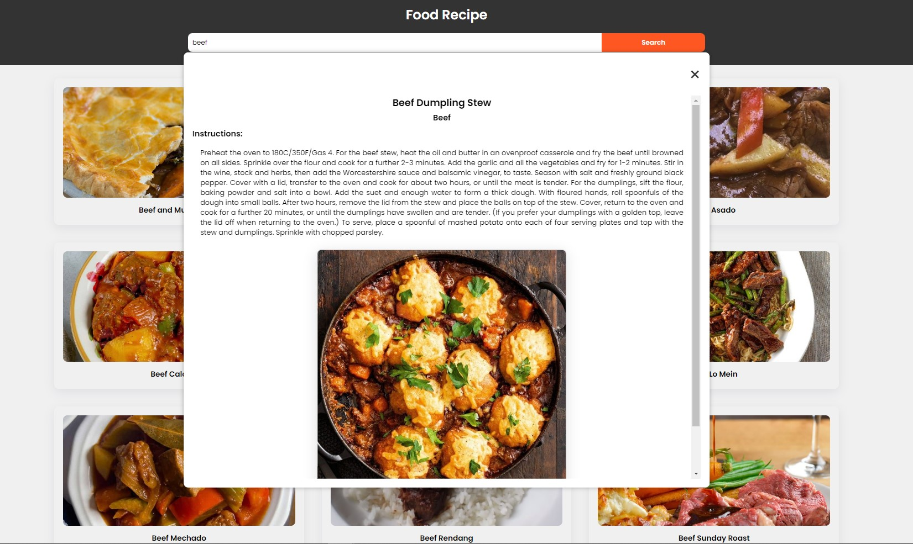

Code a food recipe app using javascript. also this project is fully responsive

Link api: https://www.themealdb.com/api/json/v1/1/filter.php?i=${ingredient}
Link website api : https://www.themealdb.com/api.php
link ref : https://www.youtube.com/watch?v=VRgA9NkhSEk

Here is project screenshot : 

